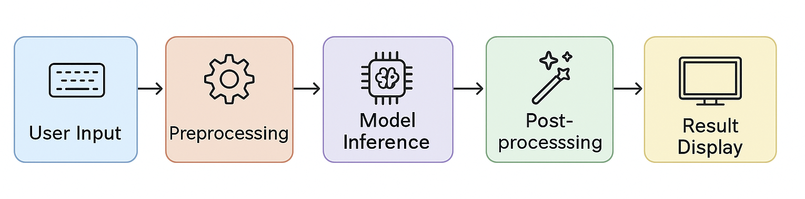
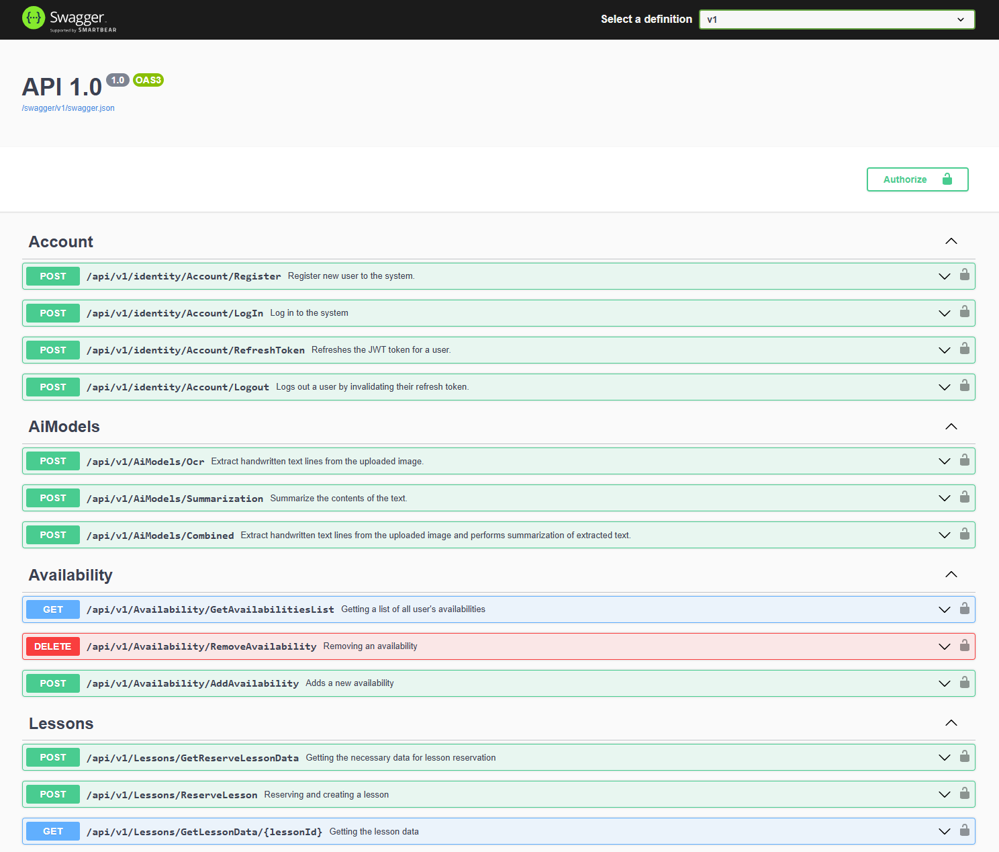
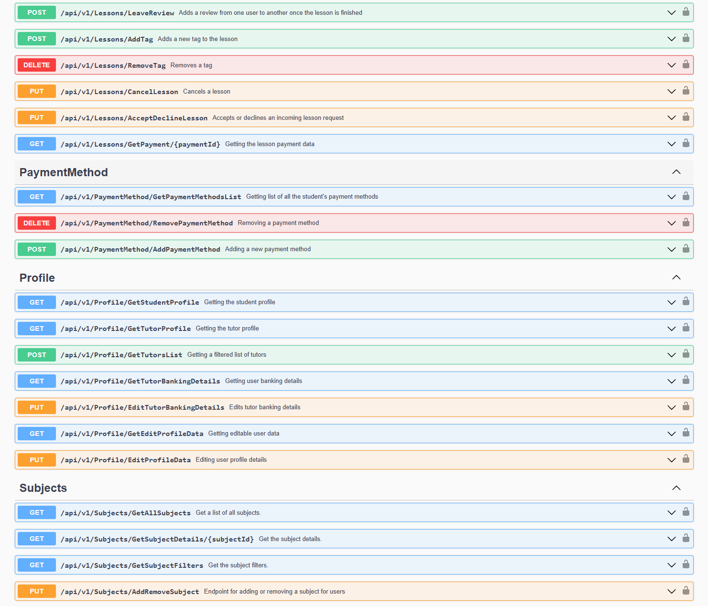

# MentorMe

A multi-application tutoring platform that connects **tutors** and **students** for 1:1 lessons, built as a modular, distributed system with a shared backend and multiple clients (Web + Mobile).

This repository contains the **ASP.NET Core backend** and serves as the API consumed by the React and Flutter applications.

> **Note:** Each MentorMe repository includes its own README with app-specific setup.
>  This README focuses on the backend, while also documenting the overall system.

---

## Table of Contents

- [About](#about)
   - [Background](#background)
   - [What the platform does](#what-the-platform-does)
- [AI features and ML models](#ai-features-and-ml-models)
   - [Model formats per platform](#model-formats-per-platform)
   - [Model development workflow](#model-development-workflow)
- [System architecture](#system-architecture)
   - [Server (ASP.NET Core)](#server-aspnet-core)
   - [React Web application](#react-web-application)
   - [Hybrid Mobile application](#hybrid-mobile-application)
- [Technologies used](#technologies-used)
- [Running the backend](#running-the-backend)
   - [Prerequisites](#prerequisites)
   - [Quick start (Docker)](#quick-start-docker)
   - [Local setup (API outside Docker)](#local-setup-api-outside-docker)
   - [Creating new migrations](#creating-new-migrations)
- [API documentation](#api-documentation)
- [Application snippets](#application-snippets)
- [Related repositories](#related-repositories)
- [Author](#author)

---

## About

### Background

MentorMe started in **2023** as my first full-blown university project, and the one that taught me the most about software development hands on.

I say that this is the project that finally made me aware of how software is made. Over time, it became my introduction to:

- distributed architecture and separation of concerns
- design patterns and clean structure
- databases, migrations, and deployment
- authentication & user management
- long-term maintenance and iteration
- mobile development
- AI integration in production-like apps

Originally built for a **Distributed Systems** course, the goal was to move away from a monolith and build a modular system with a clear split between **Client** and **Server** applications.

MentorMe quickly outgrew the course:
- I reused it as a demo/reference project across multiple other university courses.
- It became the foundation for my **Final Thesis**, where I trained and integrated OCR + summarization models across platforms.
- It helped me secure my first internship and later served as a template project for my first job.
- And it’s still the project I return to when I want to improve something “end-to-end”.

This is certainly the project I hold the closest to my heart, given how much of my personal effort went into it, and how much I learned from it. I can truly call that this is the project that made me a software developer.

### What the platform does

MentorMe is a tutoring platform built around **one-on-one sessions**.

**High-level flow:**
1. Users register as either **tutors** or **students** and create profiles.
2. Students browse subjects/lessons and discover tutors.
3. Students send lesson inquiries to tutors.
4. Tutors accept or reject inquiries.
5. When accepted, a lesson is created and both users can perform actions based on the lesson’s state.

**Core features:**
- account management (auth, profile, session refresh)
- profile management (e.g. tutor availability management, user subjects and lesson pricing)
- lesson inquiries and scheduling flow
- reviews
- chat for coordination

---

## AI features and ML models

All three applications (Web, Mobile, Backend) were extended with AI features using **custom-trained OCR and fine-tuned Summarization models**.

### Model formats per platform

Models were trained in Python using TensorFlow and then converted from standard Keras `(.h5)` into platform-friendly formats:

- **SavedModel (`.pb`)** → ML.NET integration (ASP.NET)
- **TensorFlow.js (`model.json` + shards)** → React integration
- **TensorFlow Lite (`.tflite`)** → Flutter (TF Lite) integration

The training and conversion scripts live in a separate repository: [**MentorMe TensorFlow**](https://github.com/MadridBabajev/MentorMe-TensorFlow).

### Model development workflow

Once converted, the models were integrated into each application by defining the correct input/output tensors and implementing inference flows per platform—enabling features like:
- text extraction from images (OCR)
- summarization of extracted or provided content



This process is explained in detail in my Final Thesis, available via my [LinkedIn profile](https://www.linkedin.com/in/madrid-babajev-236592238/).

---

## System architecture

MentorMe consists of:
- **React Web application**
- **Flutter Hybrid Mobile application** (Android + iOS)
- **.NET backend** (this repo)

The React and .NET applications can be containerized with Docker. As part of the original coursework, the system was deployed to **Azure Cloud Services**.

### Database (ERD)


### Server (ASP.NET Core)

The backend is built with **ASP.NET Core** and follows **Clean Architecture**, providing a layered structure with clear separation of responsibilities.

**Layers:**
- **Domain** — core entities and business models
- **DAL (Data Access Layer)** — repositories powered by Entity Framework Core
- **BLL (Business Logic Layer)** — services, orchestration, business rules
- **Public Layer** — REST API controllers protected by JWT authentication

**Key implementation details:**
- Repositories are wrapped with a **Unit of Work** for consistent transactions and efficient persistence.
- Business services are exposed through a BLL entry-point class to keep dependency wiring clean and usage consistent.
- The backend handles authentication, user management, token refresh flows, and all business rules for the tutoring platform.

**Testing:**
- **xUnit** unit tests cover core BLL services and API controllers.
- Integration tests validate API behavior across common scenarios.

### React Web application

Built with **React + TypeScript**, using:
- React Router for navigation
- Axios for API communication
- responsive UI + consistent error handling

The frontend follows an MVVM-inspired approach, separating:
- view components
- state management and hooks
- API service calls

### Hybrid Mobile application

A **Flutter** hybrid app targeting **Android** and **iOS**.

- Communicates with the same ASP.NET backend (authorization, profiles, bookings, reviews, payments).
- Uses an MVVM approach via **Riverpod** providers to keep logic separated from the widget tree.
- Includes TF Lite integration for on-device model inference.
- Uses a small **Node.js/Express** helper service using Xenova for SentencePiece tokenization, as Flutter doesn't have libraries supporting it.

---

## Technologies used

### Backend

- **C# 12**
- **.NET 8.0**
- **ASP.NET Core**
- **Entity Framework Core**
- **PostgreSQL**
- **JWT Authentication**
- **Swagger / OpenAPI**
- **AutoMapper**
- **NuGet**
- **xUnit**

### Web

- **React**
- **TypeScript**
- **Bootstrap**
- **HTML5 & CSS3**
- **NPM**
- **React Router**
- **Axios**
- **Webpack**
- **Nginx**

### Mobile

- **Flutter**
- **Dart**
- **Riverpod**
- **l10n** (localization)
- **Dio**
- **Freezed annotations**
- **Lottie**
- **TF Lite runtime + platform calls**
- **Node.js & Express.js** (SentencePiece tokenization)

### Other / Infrastructure / ML

- **Docker & Docker Compose**
- **Microsoft Azure**
- **Python**
- **Hugging Face Datasets & Transformers**
- **TensorFlow**
- **ML.NET**
- **TensorFlow.js**
- **TensorFlow Lite**
- **Xenova transformers**
- **WSL2**
- **CUDA**

---

## Running the backend

> The backend can be run fully via Docker Compose or locally with a Dockerized PostgreSQL instance.

### Prerequisites

1. **Install .NET SDK 8.0.401**  
   Download: https://dotnet.microsoft.com/en-us/download/dotnet/8.0

2. **Install Docker Desktop**  
   Ensure Docker is running.

3. **Install EF Core tools** (for migrations)
   ```bash
   dotnet tool install --global dotnet-ef
   # or update if already installed
   dotnet tool update --global dotnet-ef
   ```

### Quick start (Docker)

The easiest way to run the backend:

```bash
docker-compose up --build
```

- The API will be available at: `http://localhost:8000`
- Swagger UI is typically exposed at: `http://localhost:8000/swagger`

> **Tip:** For quick authorization during local development, check seeded users in  
> `App.DAL.EF/Seeding/AppDataInit.cs` line: 111.

### Local setup (API outside Docker)

If you prefer running the API directly on your machine but still want PostgreSQL in Docker:

1. **Start only the PostgreSQL container**
   ```bash
   docker-compose up mentorme-postgres -d
   ```

2. **Apply database migrations**
   ```bash
   dotnet ef database update --project App.DAL.EF --startup-project WebApp
   ```

3. **Run the application**
   ```bash
   cd WebApp
   dotnet run
   ```

> **Important:** On startup, the backend attempts to seed initial data. Seeding will fail if:
> - the PostgreSQL container is not running, or
> - migrations have not been applied

### Creating new migrations

When you change domain entities:

```bash
dotnet ef migrations add <MigrationName> --project App.DAL.EF --startup-project WebApp
dotnet ef database update --project App.DAL.EF --startup-project WebApp
```

---

## API documentation

The API includes Swagger/OpenAPI documentation.

Once running, open:
- **Swagger UI:** `http://localhost:8000/swagger`





> If your local port differs, check `docker-compose.yml` and/or the backend launch settings.

---

## Application snippets

To see the platform in action, run the clients locally:

- Web: [MentorMe Frontend](https://github.com/MadridBabajev/MentorMe-Frontend/tree/main)
- Mobile: [MentorMe Mobile](https://github.com/MadridBabajev/MentorMe-Flutter-Hybrid)

Snippets and UI screenshots are included in each client repository’s README.

---

## Related repositories

- [**MentorMe Frontend**](https://github.com/MadridBabajev/MentorMe-Frontend/tree/main)
- [**MentorMe Mobile**](https://github.com/MadridBabajev/MentorMe-Flutter-Hybrid)
- [**MentorMe TensorFlow**](https://github.com/MadridBabajev/MentorMe-TensorFlow)

---

## Author

_Madrid Babajev (08.02.2026)_
